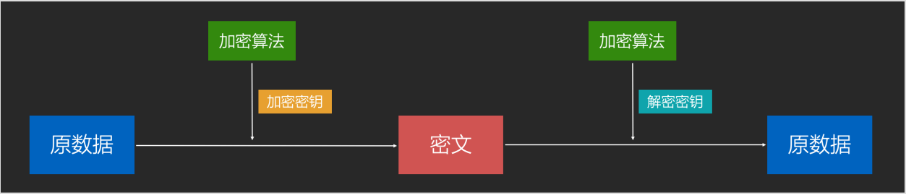
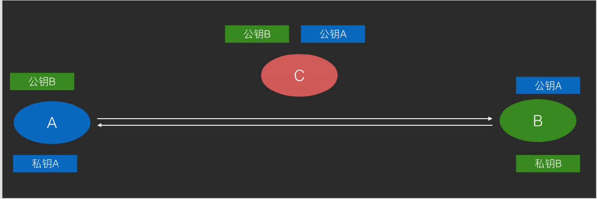

# 编码、加密、hash、序列化、字符集。

## 对称加密

* 通信双方使用同一个秘钥，使用加密算法配合秘钥将原数据进行加密得到密文，解密时使用完全逆过程的解密算法配合秘钥进行解密得到原数据。简化模型类似于古典密码学中替换式加密算法模型。

  
* 经典算法：DES（56位秘钥，由于秘钥太短被废弃），AES（128位，192位，256位秘钥）目前最流程。
* 破解：可使用暴力破解。
* 缺点：不能在不安全⽹络上传输密钥，⼀旦密钥泄露则加密通信失败。

## 非对称加密

原理：使用公钥对数据进行加密得到密文；使用私钥对数据进行解密得到原数据。非对称加密使用的是复杂的数学技巧，在古典密码学中没有对应模型。

使用非对称加密通信，可以在不可信网络上将双方的公钥传给对方，然后在发消息之前分别用对方的公钥对数据进行加密和使用自己的私钥进行签名，做到不可信网络上靠秘钥秘钥传播及加密通信。

由于私钥和公钥互相可解，因此非对称加密还可以应用于数字签名。通常会对原数据进行hash以后对hash签名，然后附加在原数据后面作为签名，这是为了让数据更小。

#### 经典算法

* RSA（用于加密和签名）
* DSA（仅用于签名，速度快）

#### 非对称加密优缺点

* 优点：可以在不安全的网络上传输秘钥。
* 缺点：计算复杂，性能相比对称加密差很多。

## Base64

将二进制数据转成由64个字符组成的字符串的编码算法。

什么是二进制数据？

* 广义：所有计算机数据都是二进制数据。
* 狭义：非文本数据即二进制数据。

用途：

* 将二进制数据扩充了存储和传输途径。（例如可以把数据保存文本文件、可以通过聊天软件进行文本传输、可以在url中传输）。
* 人眼可以读懂的字符串变成读不懂的字符串，降低偷窥风险。

Base64加密传输图片，可以更安全和高效吗？

首先base64不是加密算法，base64编码由于自身原理（6位变8位）的原因，会导致原数据增加1/3，降低网络性能，增加用户流量开销，画蛇添足的手段。

base64传输图片的目的只有需要用文本传输图片的时候使用。除此之外，完全可以舍弃此手段。

## URL encoding

在url的字符串中，对于一些不用于特殊用途的保留字符，使用%为前缀进行单独编码，以免解析错误。

## 压缩和解压缩

压缩：将数据使用更具有存储优势的编码算法进行编码，属于编码过程；常见的压缩算法：ZIP里面的压缩，JPEG,MP3。

解压缩：将压缩数据解码还原成原来的形式，以方便使用，属于解码过程。

压缩主要目的是为了减少占用的存储空间。

## 图片、音视频编解码

将图片、音频、视频数据图通过编码来转换成存档形式，以及从存档形式转换回来。

* 图片编码：比如将图像数据协程JPG\PNG等文件的编码格式。
* 图片解码：把JPG、PNG等文件中的数据解析成标准的图像数据。
* 音视频编解码：音视频编解码也同理。

## 序列化

把数据对象转换成字节序列的过程。

目的：让内存中的对象可以被存储和传输。

反序列化：把字节序列重新转换成内存中的对象

## Hash

把任意数据转换成指定大小范围的数据。

* 作用：摘要、数字指纹。
* 精点算法：MD5、SHA1、SHA256等。
* 实际用途：
  * 数据完整性校验。
  * 快速查找：hashCode和hashMap。
  * 隐私保护：对密码进行一层hash。

## 字符集

一个由证书向现实世界中的的文字符号的Map。

* ASCII：128个字符，1字节。
* ISO-8859-1：对 ASCII 进⾏扩充，1 字节。
* Unicode：13 万个字符，多字节。
  * UTF-8：Unicode 的编码分⽀。
  * UTF-16 ：Unicode 的编码分⽀。
* GBK / GB2312 / GB18030：中国⾃研标准，多字节，字符集 + 编码。
