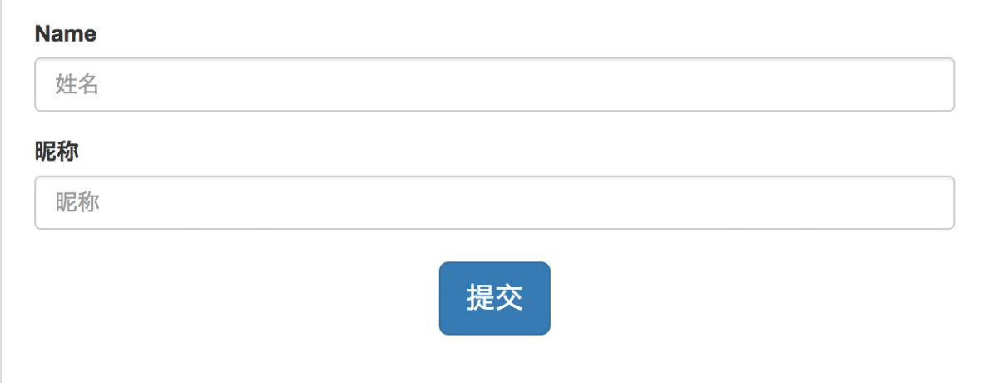

# Http到底是什么

特点：一次配置，终身使用。

* 浏览器地址直接输入。
* Android中发送网络请求。

# 什么是HTTP(HyperText Transfer Protocol 超文本传输协议)

* 超文本：在电脑中显示的、含有可以指向其他文本的链接的文本——html。

本质上就是一种通信规则，什么时候不需要规则呢？当智能化非常高的时候。

# Http的工作方式

最简单的方式：

1. 浏览器：输入地址 回车。浏览器拼装http报文发送请求->服务器处理请求发送响应报文->浏览器，浏览器解析响应报文并使用渲染引擎（浏览器内核）渲染出响应内容。
2. 手机App:用户点击或者界面触发联网请求->Android代码拼装Http报文发送请求->服务器处理请求报文发送响应报文->Android代码处理响应报文做出相应处理(存储、响应UI等)。

# URL->HTT报文

* http（协议类型）://baidu.com（服务器地址）：8080（端口号）/user?gender=male（路径）
* 报文格式：Request->请求行：RequestUrl（请求地址），Method（请求方法），Path（定位资源），Http version等），Headers：（键值对），Body：（内部实质内容，提供给服务器具体信息）
* 响应报文：Response->状态行：Http version ，Status code， Status message 这些信息主要给开发人员看的，Headers：（键值对），Body：（内部实质内容，提供给客户端具体信息）

# Request Method 请求方法

* GET
  * 用于获取资源
  * 对服务器数据不进行修改
  * 不发送body，具有幂等性，如有body纯属不规范菜鸡.
* POST
  * 用于增删修改服务器资源
  * 发送给服务器的内容写在body里，不具有幂等性。
* PUT
  * 修改资源，有body。跟POST类似，看后台使用哪种。
  * 跟POST区别，具有幂等性。
* DELETE
  * 删除资源
  * 不发送body，具有幂等性。
* HEAD
  * 和GET用法完全相同
  * 返回响应没有body，一般用作于测试链接有效性。

# 状态码

* 1xx：临时性消息。
* 2xx：成功。
* 3xx：重定向。
* 4xx：客户端错误。
* 5xx：服务器错误。

# Header

* 作用：HTTP消息的元数据（metedata），也可以说是数据的属性，对数据进行修饰的。
  * Host：目标主机地址，在目标主机定位子服务器。
  * DNS查询(Domain Name System 域名系统)：通过DNS服务器查找域名对应的IP地址。
  * Content-Length:指定Body长度(字节)
    * text/html：html文本，用于浏览器页面响应。

      
    *
    * application/x-www-form-urlencoded：普通表单（纯文字表单），encode URL格式

      
    * multipart/form-data:多部分形式。使用这种方式来上传图片是目前主流的方式。
    * application/json ：json形式，用于Api的响应或者POST/PUT请求。
    * image/jpeg , application/zip等：单文件，用于Api的响应或者POST/PUT请求。
  * Content-Type：指定Body类型。
  * Location:重定向的目标URL。
  * User-Agent:用户代理。即是谁实际发送请求、接受响应的，例如⼿机浏览器、某款⼿机 App。
  * Transfer:chunked（分块传输编码）⽤于当响应发起时，内容⻓度还没能确定的情况下。和 Content-Length 不同时使⽤。⽤途是尽早给出响应，减少⽤户等待。
  * Range / Accept-Range：按范围取数据
    * Accept-Range: bytes 响应报⽂中出现，表示服务器⽀持按字节来取范围数据
    * Range: bytes=<start>-<end> 请求报⽂中出现，表示要取哪段数据
    * Content-Range:<start>-<end>/total 响应报⽂中出现，表示发送的是哪段数据
      作用：断点续传、多线程下载。

# 其他Headers

* Accept: 客户端能接受的数据类型。如 text/html。
* Accept-Charset: 客户端接受的字符集。如 utf-8。
* Accept-Encoding: 客户端接受的压缩编码类型。如 gzip。
* Content-Encoding：压缩类型。如 gzip。

# Cache

作用：在客户端或中间⽹络节点缓存数据，降低从服务器取数据的频率，以提⾼⽹络性能。
