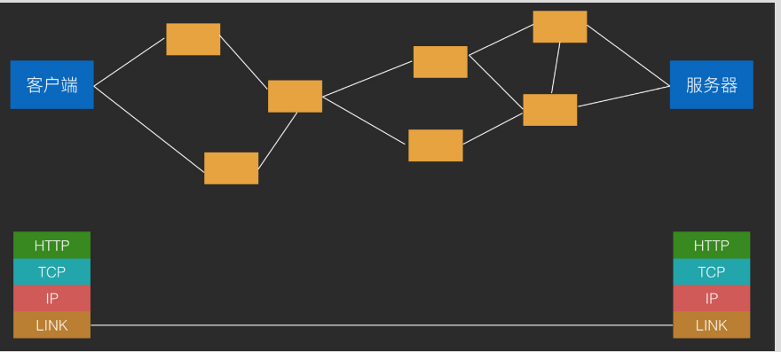

## TCP/IP 协议族

TCP是一个网络分层模型，为什么要分层，因为网络不稳定。具体分层：

* 应用层：HTTP、FTP、DNS
* 传输层：TCP、UDP ->主要负责拆分、拼接数据。
* 网络层：IP->以最小单位来发送和接收分块的网络数据以及ip选址，路由等操作。
* 数据链路层：以太网、wifi->物理支持。

##### 什么叫连接

连接其实是tcp的链接，是一种有状态的链接。既通信双方确认可以通信，不会将对方消息丢失，为建立链接。

##### 什么叫长连接

移动网络不属于Internet，而且在运营商的内网，并不具有真正公网IP，因此当一个TCP连接在一段时间内不通信之后，网关出于网络性能考虑而关闭这条TCP链接和公网连接通道，

导致这个TCP端口不再接收外部通信消息，即TCP连接被动关闭。

长连接方式：心跳。一定时间间隔内，使用TCP连接发送超短无意义的消息让网关不能将自己定义为空闲连接，防止被关闭掉。
